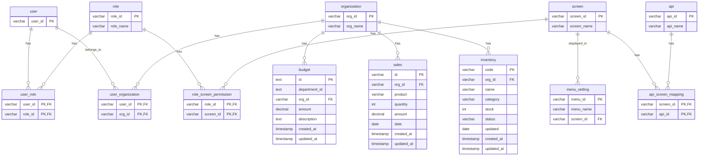

# ER図 - 権限管理システム

## データベース設計

権限管理システムのデータベース設計を示すER図です。

## テーブル説明

### 認証・権限管理

#### user（ユーザー）
- **user_id**: ユーザーID（主キー）
- システムにログインするユーザーを管理

#### role（ロール）
- **role_id**: ロールID（主キー）
- **role_name**: ロール名
- 管理職、営業担当、在庫管理者、システム管理者などのロールを定義

#### organization（組織）
- **org_id**: 組織ID（主キー）
- **org_name**: 組織名
- 本社、支店、部門などの組織階層を管理

#### user_role（ユーザーロール）
- **user_id**: ユーザーID（主キー、外部キー）
- **role_id**: ロールID（主キー、外部キー）
- ユーザーとロールの多対多の関係を管理

#### user_organization（ユーザー組織所属）
- **user_id**: ユーザーID（主キー、外部キー）
- **org_id**: 組織ID（主キー、外部キー）
- ユーザーと組織の多対多の関係を管理（複数組織への所属が可能）

#### role_screen_permission（ロール画面権限）
- **role_id**: ロールID（主キー、外部キー）
- **screen_id**: 画面ID（主キー、外部キー）
- ロールごとにアクセス可能な画面を定義

### 画面・API管理

#### screen（画面）
- **screen_id**: 画面ID（主キー）
- **screen_name**: 画面名
- システム内の各画面（予算管理、販売管理など）を定義

#### api（API）
- **api_id**: API ID（主キー）
- **api_name**: API名
- バックエンドAPIのエンドポイントを管理

#### menu_setting（メニュー設定）
- **menu_id**: メニューID（主キー）
- **menu_name**: メニュー名
- **screen_id**: 画面ID（外部キー）
- ナビゲーションメニューの設定を管理

#### api_screen_mapping（API画面マッピング）
- **screen_id**: 画面ID（主キー、外部キー）
- **api_id**: API ID（主キー、外部キー）
- APIと画面の関連を定義（どの画面がどのAPIを使用するか）

### 業務データ

#### budget（予算）
- **id**: 予算ID（主キー）
- **department_id**: 部門ID
- **org_id**: 組織ID（外部キー）
- **amount**: 予算額
- **description**: 説明
- **created_at**: 作成日時
- **updated_at**: 更新日時
- 組織別の予算データを管理

#### sales（販売）
- **id**: 販売ID（主キー）
- **org_id**: 組織ID（外部キー）
- **product**: 商品名
- **quantity**: 数量
- **amount**: 金額
- **date**: 販売日
- **created_at**: 作成日時
- **updated_at**: 更新日時
- 組織別の販売データを管理

#### inventory（在庫）
- **code**: 商品コード（主キー）
- **org_id**: 組織ID（外部キー）
- **name**: 商品名
- **category**: カテゴリ
- **stock**: 在庫数
- **status**: ステータス（in-stock, low-stock, out-of-stock）
- **updated**: 更新日
- **created_at**: 作成日時
- **updated_at**: 更新日時
- 組織別の在庫データを管理

## データアクセス制御

1. ユーザーは複数の組織に所属可能（user_organization）
2. ユーザーは複数のロールを持つことが可能（user_role）
3. ロールによって画面へのアクセス権限が決定（role_screen_permission）
4. 業務データ（予算、販売、在庫）は組織IDでフィルタリング
5. ユーザーは所属する組織のデータのみ閲覧・編集可能