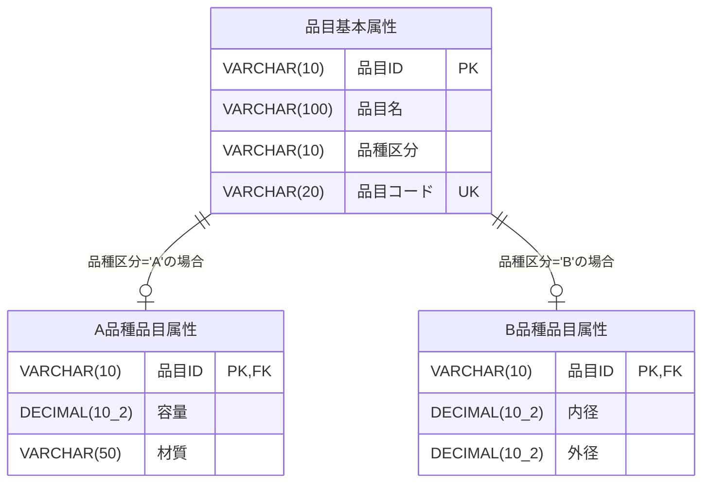

# コード体系 ER図

## テーブル説明

### 品目基本属性
- 全品目の共通属性を管理するマスターテーブル
- 品種区分により、A品種またはB品種に分類される
- 品目コードは一意制約により重複不可

### A品種品目属性
- A品種（容器系）の品目固有属性を管理
- 容量と材質の情報を保持

### B品種品目属性
- B品種（パイプ系）の品目固有属性を管理
- 内径と外径の情報を保持

## リレーションシップ
- 品目基本属性と各品種属性テーブルは1対0..1の関係
- 品目IDを外部キーとして結合
- CASCADE DELETEにより、基本属性の削除時に関連する品種属性も削除される