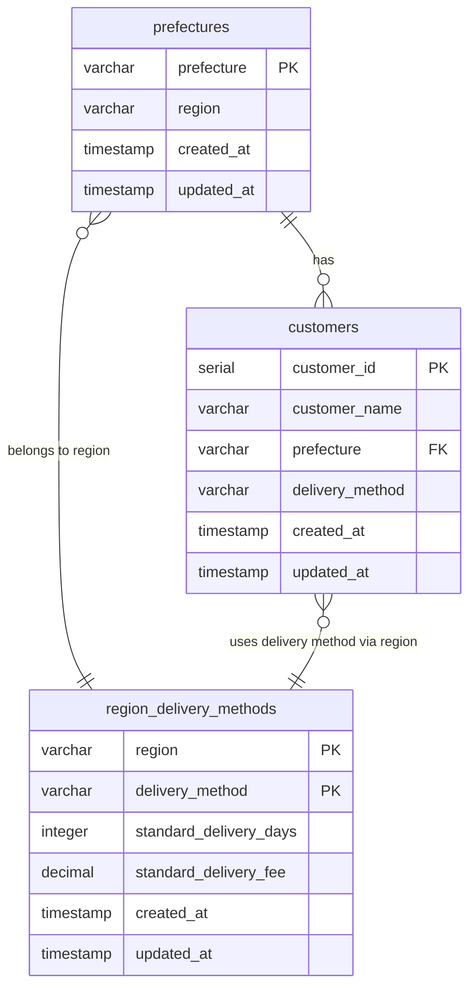

# ER図

## テーブル説明

### 地域別配達方法マスタ (region_delivery_methods)
- **主キー**: (region, delivery_method)
- 地域と配達方法の組み合わせごとに、標準配達日数と料金を管理

### 都道府県マスタ (prefectures)
- **主キー**: prefecture
- 都道府県と地域の対応を管理

### 顧客マスタ (customers)
- **主キー**: customer_id
- **外部キー**: prefecture → prefectures.prefecture
- 顧客情報と配達方法を管理

## 初期データ

### 地域別配達方法マスタ
- (関西, 通常, 1日, 300円)
- (中部, 通常, 3日, 300円)
- (中部, 特急, 1日, 600円)

### 都道府県マスタ
- (大阪府, 関西)
- (三重県, 中部)

### 顧客マスタ
- (Aさん, 大阪府, 通常)
- (Bさん, 三重県, 通常)
- (Cさん, 三重県, 特急)