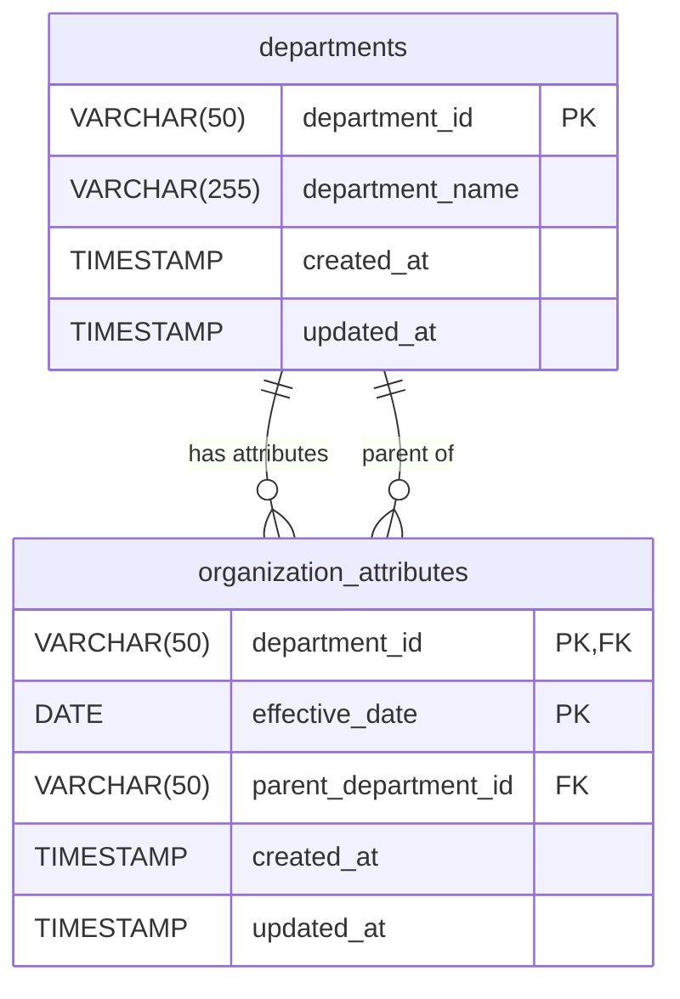

# ER図 - ピラミッド構造データモデル

## Mermaid形式



## テーブル説明

### departments（部門テーブル）
- 部門の基本情報を管理
- department_idが主キー

### organization_attributes（期間別組織属性テーブル）
- 時系列での組織構造を管理
- department_idとeffective_dateの複合主キー
- parent_department_idで親部門を参照（自己参照）

## ER図生成方法

### 1. PlantUML
```bash
# PlantUMLをインストール
sudo apt-get install plantuml

# PNG形式で出力
plantuml er-diagram.puml
```

### 2. Mermaid（ブラウザで表示）
- このMarkdownファイルをGitHubやVSCodeで開くと自動的にレンダリングされます
- オンラインエディタ: https://mermaid.live/

### 3. DDLから自動生成するツール

#### pgModeler（PostgreSQL専用）
```bash
# pgModelerをインストール（GUI）
# DDLをインポートしてER図を自動生成可能
```

#### SchemaSpy
```bash
# DockerでSchemaSpy実行
docker run -v "$PWD:/output" schemaspy/schemaspy:latest \
  -t pgsql \
  -host localhost \
  -db yourdb \
  -u postgres \
  -p password \
  -o /output
```

#### dbdiagram.io
- オンラインツール: https://dbdiagram.io/
- DDLからER図を生成可能

### 4. Docker Composeでの実行
既存のdocker-compose.ymlを使用してPostgreSQLを起動し、ツールでER図を生成：

```bash
# DBを起動
docker-compose up -d

# psqlでDDLを確認
docker-compose exec db psql -U postgres -d pyramid_db
```